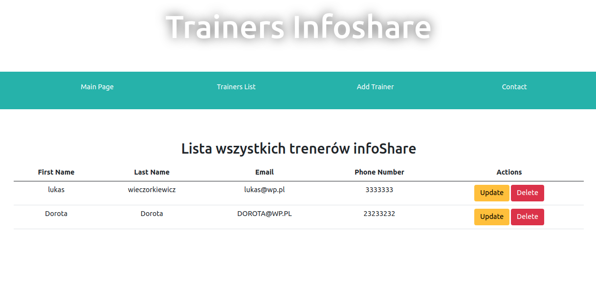
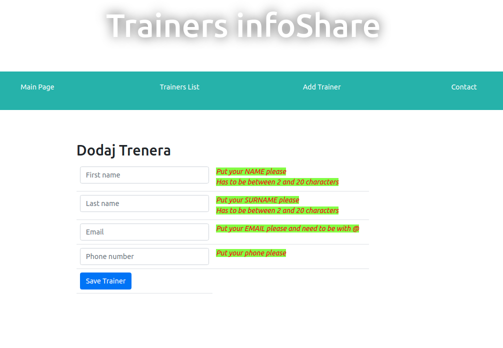

# Aplikacja TrainersApp

---

Aplikacja wymaga bazy danych, ktora mozna utworzyc na dockerze:

 docker run -p 0.0.0.0:3306:3307 --name trainers -e MYSQL_ROOT_PASSWORD=toor -e MYSQL_DATABASE=trainers -d mysql
 
Widoki dzialajacej aplikacji:

 
## Author

Łukasz Wieczorkiewicz